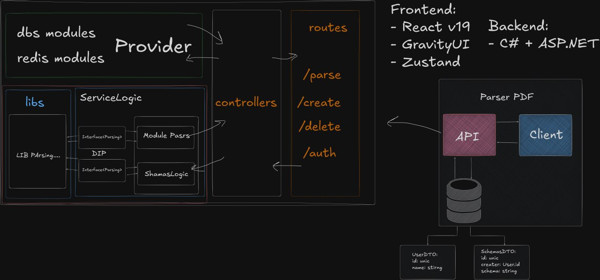

# MVP "D-DOCS"

**Цель спринта:** Разработать и запустить минимально жизнеспособную версию (MVP) приложения, включающую базовую аутентификацию и функционал(формы на странице) для создания/редактирования заметок в формате Markdown.

**Технологический стек:**
*   **Frontend:** React v19, GravityUI, Zustand
*   **Backend:** C# + ASP.NET Core
*   **База данных:** PostgreSQL

**Архитектурная схема для иллюстрации:**

---

### Задачи на спринт:

#### 1. Создание шаблона Frontend

*   **Задача:** Инициализировать проект на React v19.
*   **Детали:**
    *   Настроить базовую структуру проекта: компоненты, сервисы, хуки.
    *   Установить и настроить ключевые библиотеки: `GravityUI` для UI-компонентов и `Zustand` для управления состоянием.
    *   Создать базовую разметку приложения (макет): место для боковой панели, основной контентной области и хедера.

#### 2. Реализация фичи авторизации

*   **Задача:** Добавить аутентификацию пользователей на основе JWT.
*   **Детали:**
    *   **Backend (ASP.NET Core):**
        *   Создать модель и таблицу `users` в PostgreSQL.
        *   Реализовать эндпоинты для регистрации и входа (`/auth` согласно схеме).
        *   Настроить генерацию и валидацию JWT-токенов.
    *   **Frontend (React):**
        *   Создать страницы/формы для входа и регистрации.
        *   Реализовать логику отправки запросов на бэкенд и сохранения токена (например, в `localStorage`).
        *   Настроить защищенные роуты, доступные только авторизованным пользователям.

#### 3. Реализация текстового редактора Markdown

*   **Задача:** Создать основной функционал для работы с заметками.
*   **Детали:**
    *   **Backend (ASP.NET Core):**
        *   Создать модель и таблицу `notes` в PostgreSQL (поля: `ID`, `Title`, `Content`, `UserId`).
        *   Реализовать CRUD-эндпоинты для заметок (`/create`, `/delete`, а также для получения и обновления).
    *   **Frontend (React):**
        *   Создать компонент текстового поля для ввода Markdown.
        *   Интегрировать библиотеку для рендеринга Markdown (например, `marked.js` или `react-markdown`) для предпросмотра в реальном времени.
        *   Создать UI для списка заметок и основного редактора.

#### 4. Интеграция Frontend и Backend

*   **Задача:** "Сшить" клиентскую и серверную части.
*   **Детали:**
    *   Настроить взаимодействие React-приложения с API ASP.NET Core.
    *   Реализовать вызовы API для всех реализованных функций:
        *   Регистрация и вход пользователя.
        *   Загрузка списка заметок пользователя после входа.
        *   Создание, редактирование и удаление заметок.
    *   Обеспечить передачу JWT-токена в заголовках авторизации для защищенных запросов.

#### 5. Стабилизация и исправление багов

*   **Задача:** Протестировать и отладить базовый функционал MVP.
*   **Детали:**
    *   Провести комплексное тестирование всего процесса: от регистрации нового пользователя до создания и редактирования его первой заметки.
    *   Выявить и исправить основные ошибки, связанные с интеграцией, отображением данных и логикой работы.
    *   Убедиться, что основной сценарий использования работает стабильно.